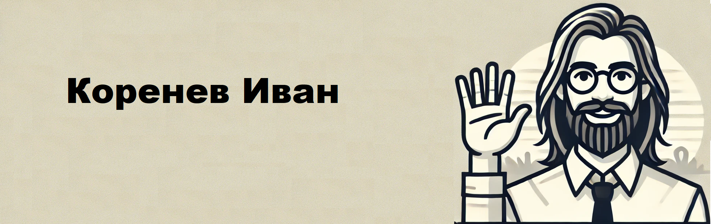

Меня зовут Иван, я магистрант по специальности «Инженерия искусственного интеллекта» в Уральском федеральном университете и выпускник бакалавриата по направлению «Информатика и вычислительная техника». Мои профессиональные интересы сосредоточены в областях системного администрирования, машинного обучения и автоматизации процессов. Я занимался созданием корпоративных сетей на базе Windows Server, настройкой Active Directory, внедрением CRM-систем и разработкой автоматизированных решений для проверки данных.

В рамках проектов я разработал систему анализа текста на основе моделей машинного обучения (RoBERTa), автоматизировал процессы MLOps и создал инструмент для проверки документов, используя Python, PyPDF2, pandas и TensorFlow. Также я увлечён разработкой учебных материалов по программированию, адаптируя их под разные уровни подготовки, и активно участвую в open-source проектах, делая вклад в развитие технологий и делясь опытом с сообществом.

Свяжитесь со мной:
📧 Email: korenev.ivan96@gmail.ru
🔗 Telegram: Tg: https://t.me/notstatement
